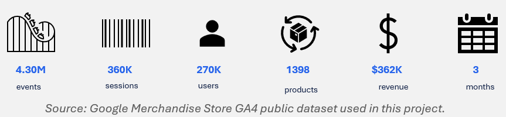
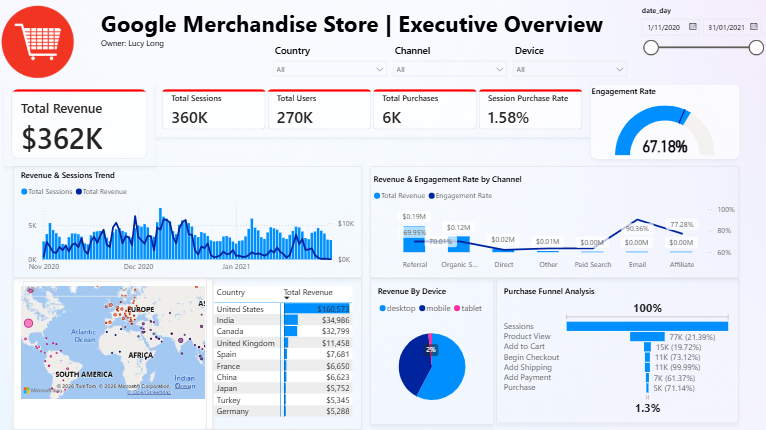
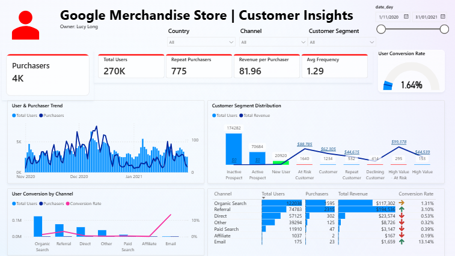
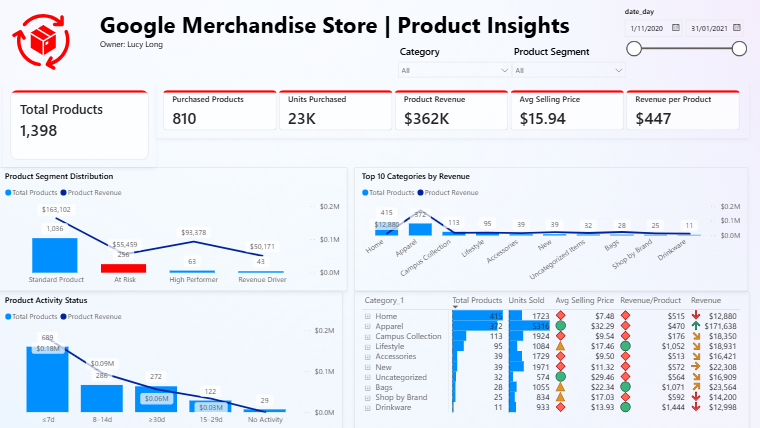
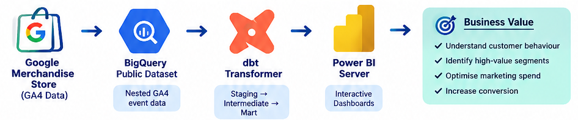

# GA4 E-commerce Analytics

**From nested Google Analytics events to decision-ready customer and product insights**

**Min Long (Lucy)** — Data Analyst | Analytics Engineer | BI Developer

<p align="left">


</p>

---

## ⭐ Project Highlights

A hands-on digital analytics project using the **Google Merchandise Store GA4 public dataset**, transforming ~3 GB of nested event data into tested, business-ready models and interactive Power BI reporting.

**4.30M events | 360K sessions | 270K users | 1,398 products | $362K revenue | 3 months**

- Raw nested GA4 events modelled in **BigQuery + dbt**
- Reusable **Staging → Intermediate → Mart** analytics layers
- Smooth cloud analytics flow from **BigQuery → dbt → Power BI**
- Executive, customer and product dashboards
- Customer and product segmentation for **targeted next actions**
- Analytical outputs ready to support future **Segment CDP, Braze or CRM** activation




---

# 📊 Power BI Dashboards

> Export the three dashboard pages to `docs/` using the filenames below.

### Executive Overview


**Overall KPIs & trends | Channel/country/device performance | Engagement monitoring | Conversion funnel**

### Customer Insights


**Customer performance | Actionable segmentation | Customer trends | Channel conversion**

### Product Insights


**Product performance | Product segmentation | Activity/recency | Category performance**

---

# 🚀 End-to-End Analytics Flow



**GA4 nested events → BigQuery → dbt Staging / Intermediate / Mart → Power BI → business insights and activation-ready segments.**

The raw GA4 structure is preserved in BigQuery while business-relevant attributes are promoted into reusable analytical models.

---

# 🎯 Key Outcomes

| Outcome | Result |
|---|---|
| **End-to-End Data Pipeline** | Transformed nested GA4 events into BI-ready analytical models |
| **Dynamic BI Reporting** | Enabled KPI monitoring, trends and interactive performance analysis |
| **Actionable Segmentation** | Identified customer and product segments for targeted actions |
| **Activation Ready** | Outputs can support future Segment CDP, Braze or CRM activation |

---

# 💡 Solution Design Principles

- **Incremental-Ready Metrics** — Use the dataset end date as the reference date and rolling windows for activity/inactivity.
- **Scalable Analytics Layers** — dbt separates source cleaning, reusable logic and business marts.
- **Cloud-to-Cloud Reporting** — BigQuery → dbt → Power BI provides a refreshable analytics flow.
- **Actionable Segmentation** — Convert customer and product behaviour into segments for next actions.

---

# 📖 Project Overview

The project demonstrates how a modern analytics team can move beyond standard GA4 reporting and build a governed analytical layer for deeper customer, ecommerce and marketing analysis.

### Business Questions

- How is ecommerce performance changing over time?
- Which channels generate users, purchases and revenue?
- Which customer groups generate the most value?
- Which customers are active, declining or at risk?
- Which products and categories drive commercial performance?
- Where do users drop out of the conversion journey?
- How can behavioural segments support targeted actions?

---

# 🛠 Technology Stack

| Layer | Technology | Purpose |
|---|---|---|
| Digital Analytics | GA4 | Event-driven website behaviour |
| Data Warehouse | Google BigQuery | Raw storage and SQL processing |
| Transformation | dbt Core | Modelling, testing and documentation |
| Analytics Layers | Staging / Intermediate / Mart | Clean → business logic → BI outputs |
| BI | Power BI | Semantic model, DAX and dashboards |
| Version Control | Git / GitHub | Code and documentation |

---

# 🗃 Dataset

Approximately **3 GB of nested GA4 ecommerce data covering 3 months and 4.30M events**.

| Variable Group | Examples | Raw Type | Availability / Quality |
|---|---|---|---|
| Event | event_date, timestamp, event_name | Scalar | Core fields mostly complete |
| Event Parameters | session ID, page location, engagement | ARRAY&lt;STRUCT&gt; | Availability depends on event type |
| User | user_pseudo_id, user_id, first-touch timestamp | Scalar | pseudo ID useful; user ID limited |
| User Properties | key, value, timestamp | ARRAY&lt;STRUCT&gt; | Very sparse |
| Device | category, brand, OS, browser | STRUCT | Main fields well populated |
| Geography | country, region, city, metro | STRUCT | Mixed completeness |
| Traffic Source | source, medium, campaign | STRUCT / parameters | Useful but contains placeholders |
| Ecommerce | revenue, quantity, transaction ID | STRUCT | Event-dependent |
| Items | ID, name, category, price, quantity, revenue | ARRAY&lt;STRUCT&gt; | Item-event dependent |
| App Info | app identifiers/version | STRUCT | Mostly unavailable for web data |

```text
One Event
├── One Device                 STRUCT
├── One Geo                    STRUCT
├── One Traffic Source         STRUCT
├── One Ecommerce Summary      STRUCT
├── Many Event Parameters      ARRAY<STRUCT>
├── Many Items                 ARRAY<STRUCT>
└── Many User Properties       ARRAY<STRUCT>
```

---

# 🧹 Data Quality: Validate Before Modelling

Data quality was assessed by **priority, affected proportion and business impact** before deciding whether to clean, retain, exclude or investigate.

| Challenge | Issue | Resolution |
|---|---|---|
| **Sparse & missing data** | Many fields are poorly populated, e.g. `user_properties` | Profile missingness; exclude low-value fields |
| **`(not set)` values** | Placeholder categories occur across the dataset | Standardise `(not set)` as NULL |
| **Missing first-touch data** | A small proportion lack `user_first_touch_timestamp` | Accept and document minor segmentation impact |
| **Inconsistent hierarchy** | Product category paths are inconsistent | Clean and split hierarchy in Intermediate |
| **Geographic ambiguity** | Same city names can exist across countries | Keep country/region context; geo enrichment later |
| **Product ID duplication** | `item_id` is not always unique | Create `product_key` = Item ID + Item Name |
| **Missing product views** | Some products have activity/sales without `view_item` | Exclude view-based KPIs from core product analysis |
| **Incomplete cart journey** | Some products have purchases without recorded cart events | Avoid unreliable cart conversion KPIs; investigate further |

**Key modelling decision:** trusted purchase and revenue signals were prioritised rather than forcing an apparently complete product funnel.


---

# 📈 Key Dataset Validation

**Ecommerce:** 5,692 purchase events | 4,452 transactions | $362,165 revenue | ~$69.09 AOV | 22,720 items purchased

| Event | Count |
|---|---:|
| page_view | 1,350,428 |
| user_engagement | 1,058,721 |
| scroll | 493,072 |
| view_item | 386,068 |
| session_start | 354,970 |
| first_visit | 257,462 |
| view_promotion | 190,104 |
| add_to_cart | 58,543 |
| begin_checkout | 38,757 |
| select_item | 31,007 |
| purchase | 5,692 |

---

# ⚠️ Limitations

- Public GA4 sample data rather than a live production implementation
- Approximately three months of data limits long-term seasonality analysis
- Sparse `user_properties`, authenticated `user_id`, app information and some identifiers
- `(not set)` and deleted/other values reduce attribution detail
- Small amount of missing first-touch data
- Incomplete product `view_item` tracking
- Some purchases have no corresponding recorded add-to-cart activity
- Geographic identity can be improved with stronger location keys / geo enrichment
- `user_pseudo_id` limits cross-device customer identity resolution
- Segment CDP, Braze and CRM are future activation targets, not implemented integrations
---

# 🏗 dbt Transformation Architecture

```text
GA4 / BIGQUERY
Nested events
      ↓
STAGING
Flatten & clean
      ↓
INTERMEDIATE
Business grain
      ↓
MART
Facts, dimensions & segments
      ↓
POWER BI
```

### Staging
- Generate event keys and remove exact duplicates
- Standardise dates and timestamps
- Flatten useful STRUCT fields
- Extract selected business-relevant `event_params`
- Flatten item data where required

The full nested `event_params` remains available in raw BigQuery data; only parameters needed downstream are promoted into the main staging model.

### Intermediate
- `int_sessions` — session reconstruction and engagement
- `int_users` — user behaviour and customer metrics
- `int_products` — product activity, purchases and revenue

### Mart

```text
analytics_mart
├── dim_date
├── dim_channel
├── fact_sessions
├── mart_customer_segmentation
└── mart_product_segmentation
```

dbt tests validate important requirements including **not-null fields, unique keys and accepted segmentation values**.

---

# 📐 Power BI Semantic Model

The semantic model separates session/customer analysis from product analysis, with shared dimensions and centralised DAX measures.

- **Fact:** `fact_sessions`
- **Dimensions:** `dim_date`, `dim_channel`
- **Customer:** `mart_customer_segmentation`
- **Product:** `mart_product_segmentation`
- **Measures:** centralised DAX measure table

Reporting covers revenue, users, sessions, purchases, engagement, time trends, channel/country/device performance, funnel analysis and customer/product segmentation.

---

# 👥 Customer Segmentation

Segments are mutually exclusive and assigned by priority.

| Segment | Business Logic |
|---|---|
| **High Value – At Risk** | Revenue ≥ $176; inactive ≥30d; ≥2 sessions |
| **High Value** | Revenue ≥ $176 |
| **Repeat Customer** | ≥2 purchases |
| **At Risk Customer** | Purchased; inactive ≥30d; ≥2 sessions |
| **Declining Customer** | Purchased; recent sessions <50% of previous 30d |
| **New User** | First visit within 7d |
| **Customer** | ≥1 purchase |
| **Active Prospect** | No purchase; visited within 30d |
| **Inactive Prospect** | No purchase and does not meet active criteria |

---

# 📦 Product Segmentation

| Segment | Business Logic |
|---|---|
| **At Risk** | Historical purchases; no activity for ≥30 days |
| **High Performer** | Top 20% for both purchases and revenue in last 30 days |
| **Revenue Driver** | Top 20% revenue; not High Performer / At Risk |
| **Standard Product** | Does not meet criteria above |

Product segmentation prioritises **purchase, revenue and recency** because validation identified gaps in product view and cart tracking.

---


# 🔮 Future Enhancements

- Incremental ingestion and scheduled dbt / Power BI refresh for live GA4
- Stronger customer identity resolution
- Ecommerce event instrumentation review
- Geographic enrichment
- Segment CDP / Braze / CRM activation
- Next-best-product recommendations from customer purchase behaviour
- Campaign experimentation and A/B testing
- Additional business marts

---

# 💼 Skills Demonstrated

**GA4 | BigQuery SQL | Nested Data | dbt | Data Quality | Analytics Engineering | Customer Analytics | Ecommerce Analytics | Segmentation | Power BI | DAX | BI Storytelling**

---


# 💡 Key Learning

**Analytics engineering is not about transforming every available field.** Raw event data must first be validated against its business meaning; KPIs, models and segments should then use signals reliable enough for the intended decision.

---

# 📄 Data Source

**Google Merchandise Store GA4 public dataset**, accessed through Google BigQuery.

This repository is a portfolio analytics project built for learning and demonstration purposes.
